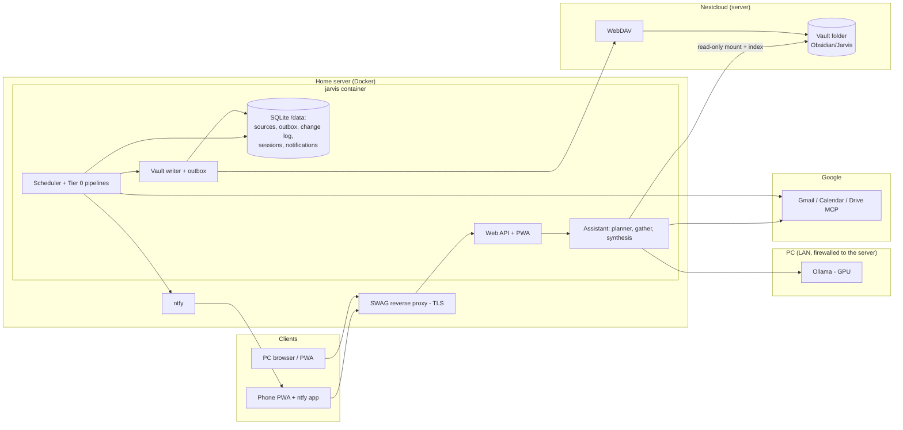

# Jarvis Architecture: Server-Hosted, PC-Powered

Jarvis runs as a container on the home server behind SWAG at `https://jarvis.keeeys.uk`.

- **Vault:** a folder in **Nextcloud** on the same server. Jarvis reads the files from a read-only mount, keeps its own index of them, and writes through Nextcloud's WebDAV API. Obsidian on the PC and the phone syncs that folder through Nextcloud.
- **The PC is only used for Ollama** on the GPU.

Notifications go through ntfy on the server. Deployment steps are in [DEPLOY.md](DEPLOY.md). How Jarvis stores knowledge, keeps AI use low and learns new things is in [KNOWLEDGE_AND_LEARNING.md](KNOWLEDGE_AND_LEARNING.md).

## Decisions

| Decision | Choice | Consequence |
| --- | --- | --- |
| Where Jarvis runs | Container on the home server (image in `registry.keeeys.uk`) | Reachable whenever the server is up |
| Model | Ollama on the PC GPU, reached over the LAN | Chat and summaries need the PC. When it's off, lookups return raw results. |
| Knowledge store | Obsidian vault as plain files in Nextcloud on the server. Jarvis keeps its own SQLite index: FTS5 search, tags, frontmatter, links. | No Obsidian app needed on the server. The vault is available whenever the server is up. |
| Vault writes | Automatic, anywhere. They go through an outbox to Nextcloud WebDAV, and every change is logged and can be reverted. | Nextcloud syncs changes to your devices at once and keeps version history. |
| AI usage | Scripts first. The LLM is used only where a script can't do the job. | Ingestion and notifications use no LLM calls |
| Self-improvement | Generated code runs without review, but only in a sandbox container | Planned: see the knowledge doc |
| Remote access | Public HTTPS through SWAG | Password plus TOTP login. The PC firewall only accepts the server. |
| Notifications | ntfy container on the server | Keeps working while the PC is off |

## System overview



## Components

### 1. Assistant (`assistant/`)

The assistant handles each message in this order:

1. **Remember.** A message starting "remember/note/save that …" is saved straight to the vault. This step uses no LLM.
2. **Write-request guard.** Requests to send, delete, schedule and so on are refused until the confirmation step exists.
3. **Router.** A small model chooses one of these sources: `chat`, `vault`, `gmail`, `calendar`, `drive`. It returns JSON. If the model is offline, a keyword fallback chooses instead.
4. **Gather.** Read-only context is collected. For the vault this means:
   - People notes whose name (or unique first name) appears in the request.
   - Notes with any `#tag` mentioned (a JsonLogic search against Obsidian's metadata).
   - Obsidian's full-text search results.
   - Backlinks (Dataview) and outlinks of the top note.
5. **Synthesis.** The model streams an answer. Retrieved data is marked as untrusted data, and the sources are shown as links: `obsidian://` for notes, web links for Gmail and Calendar.
6. **Context.** `Jarvis/Me.md` and the recent conversation are included with each chat message.

Planned: learned skills get matched before the router, then comes native tool calling with a larger GPU model.

### 2. Connectors

| Source | Implementation | Access |
| --- | --- | --- |
| Vault | `vault/files.py`: files plus a SQLite index (FTS5, tags, frontmatter, links). Writes go through `vault/webdav.py` to Nextcloud. The old `vault/client.py` (Obsidian REST) is still available as `VAULT_BACKEND=obsidian`. | Read and write |
| Gmail | `google/gmail.py` → Gmail REST API | Read-only |
| Calendar | `google/calendar.py` → Calendar REST API | Read, plus adding events after you confirm |
| Drive | `mcp.py` → Google Drive MCP | Read-only |
| Contacts | `google/contacts.py` → People API | Read-only |
| Internet | `websearch.py` → SearXNG JSON API (container) or Brave Search API. Pages are fetched with SSRF protection. | Read-only; only the question is sent |
| Home Assistant | `ha.py` → HA REST API (`/api/states`, `/api/services`) | Read; actions only after confirmation; unlock and disarm blocked |
| Home Assistant, Immich, Nextcloud | Planned (see build slices) | — |

### 3. Pipelines and scheduler (`pipelines/`, `services.py`)

Jobs run inside the container:

| Job | Interval | What it does |
| --- | --- | --- |
| people | 60 min | Reads `People/` notes' `emails:` frontmatter, so existing notes are reused instead of duplicated |
| gmail | 5 min | Pulls changes since the stored history ID (falls back to a date search if that ID has expired). Classifies bulk mail with rules. Stores threads, links people, writes journal entries, sends notifications. |
| calendar | 15 min | Covers events from 2 days back to 60 days ahead (the first run backfills). Stores events, links attendees, writes journal entries. |
| reminders | 1 min | Sends an ntfy reminder ahead of each event (`NOTIFY_EVENT_LEAD_MINUTES`) |
| vault | 1 min | Writes the outbox to Obsidian |
| events | 10 min | Reads queued emails with the model to find events (daily budget), sends *Add to calendar?* alerts, and auto-adds invitations if `EVENTS_AUTO_ADD=ics` |
| contacts | 6 h | Syncs Google Contacts into `People/` notes (Contact section, birthdays, relations) |
| scheduled | 30 s | Sends due reminders and runs confirmed Home Assistant actions, then reschedules repeats |
| ticks | 5 min | Cancels items you ticked in `Jarvis/Reminders.md` |
| brief | 1 min | Sends the morning brief once a day at `BRIEF_TIME` |
| saves | 1 min | Sends an ntfy summary of what was saved to the vault (at most every `NOTIFY_VAULT_SAVES_MINUTES`) |
| digest | 5 min | Sends notifications held during quiet hours as one digest |

Every job can also be run on demand from the Status page.

### 4. Vault writer (`vault/writer.py`)

- Pipelines store structured data in SQLite and queue `(kind, key)` items. Kinds: `thread`, `event`, `person`, `journal`, `inbox`.
- The writer renders each item from the database. Jarvis-owned notes (`Sources/…`) are generated in full. Shared notes (`People/…`, `Journal/…`) only have their `<!-- jarvis:… -->` blocks replaced, and frontmatter keys are added but never overwritten, so your own text and properties are preserved.
- If Nextcloud can't be reached, the outbox waits.
- Every minute the **index** job re-indexes any files whose modification time or size changed, so edits made in Obsidian on your devices are picked up.
- Every write stores the before and after text in `note_history`. The **Vault** tab can revert any change.

### 5. Web and authentication (`web/`, `auth.py`)

- **Server.** Starlette plus uvicorn. Chat replies stream as NDJSON, so SWAG needs `proxy_buffering off`.
- **Login.** A single user with an scrypt-hashed password and a TOTP code. Codes are single-use (replay-protected). Login attempts are throttled (5 per 15 minutes per IP, 30 per hour in total).
- **Sessions.** Server-side sessions, 30 days sliding, stored in an `HttpOnly`, `Secure`, `SameSite=Strict` cookie.
- **Request protection.** Every state-changing API call needs the header `X-Jarvis: 1` and a matching origin (CSRF defence). Responses carry a strict CSP and other security headers.
- **Google OAuth.** Uses a Web application client with callback `/auth/google/callback`. The callback is protected by the one-time state value.

### 6. Security boundaries

- Credentials are kept only on the server: `.env` and `/data/google-token.json`. They never reach the browser or the vault.
- Content from email, calendar and the vault is framed as untrusted data in prompts. It is never used to choose actions.
- On the PC, the Windows firewall only lets the server's IP reach Ollama (port 11434).
- The vault is mounted read-only into Jarvis. All writes go through Nextcloud, so they are versioned there, and paths are checked so they can't escape the vault.
- The container runs read-only, as a non-root user, with all capabilities dropped.

### 7. Events from email (`extract/events.py`, `pipelines/events.py`)

```text
new email ─┬─ .ics invite ─────────────┐
           ├─ schema.org booking ──────┤ script ─► proposal ─► ntfy "Add to calendar?" ─► you tap Add ─► Google Calendar
           └─ date + event words ─► queue ─► model (JSON only, no tools, daily cap) ─┘            (or edit / dismiss)
```

- Proposals are stored with a fingerprint, so the same event is never proposed twice. Anything already on the calendar (matched by iCal UID, or same day and similar title) is skipped.
- Adding an event is the first write to an outside service. It always goes through a proposal, the same as future Home Assistant actions will.

### 8. Diagnostics (`diag.py`, Logs tab)

- **Traces.** Chat turns, background jobs and API actions each run inside a *trace*, held in a `contextvar`. Log entries go to SQLite (`logs`, `traces`), each carrying its trace id.
- **What's captured automatically:**
  - `httpx.AsyncClient.send` is wrapped, so every outgoing request is logged with service, status and timing. Request and response bodies are only kept in verbose mode.
  - Python `logging` records under `jarvis.*`.
  - Exceptions, with their tracebacks.
- **Decision points** call `diag.event()` with structured data: router, gather, model stats, email classification, event proposals, vault writes, notifications, Home Assistant matching, and the brief.
- **Keeping it readable:**
  - Background ticks that did nothing aren't stored.
  - Expected 404s and fallbacks are logged at debug level.
  - Secrets are redacted by key name.
  - Retention is `JARVIS_LOG_RETENTION_DAYS`.

### 9. Internet lookups (`websearch.py`)

```text
question ─► router ("web", or an explicit "look up …") ─► SearXNG search (cached 1 h)
         ─► fetch the top 3 pages (public addresses only, ≤3 redirects, ≤1.5 MB, HTML only)
         ─► pick the paragraphs that overlap with the question (script) ─► model answers citing [1], [2] …
```

- If the model is offline, the top results are shown as links instead.
- Page text is framed as untrusted data, just like email content.

### 10. Voice (`tts.py`)

- `/api/tts` turns reply text into speech (Markdown and links stripped) using Kokoro-FastAPI (`/v1/audio/speech`) or ElevenLabs.
- The browser plays replies sentence by sentence, fetching the next chunk while the current one plays. It falls back to the device's own voice if server speech isn't available.

## Build slices

| # | Slice | Status |
| --- | --- | --- |
| 1 | Server package, Obsidian REST vault client, outbox and change log | ✅ v0.2 |
| 2 | Web app and PWA, password + TOTP, container, registry, SWAG | ✅ v0.2 |
| 3 | Google web OAuth; Gmail and Calendar Tier 0 ingestion to the vault | ✅ v0.2 |
| 4 | ntfy notifications: VIP senders, keywords, events, quiet hours | ✅ v0.2 |
| 5a | Events from email → Calendar (ICS, JSON-LD, model with a daily budget) with confirm-to-add | ✅ v0.3 |
| 5b | "What was saved" reports: in chat, and as an ntfy summary | ✅ v0.3 |
| 5c | Spoken replies: Kokoro-82M container, ElevenLabs, or the browser's voice | ✅ v0.3 |
| 5d | Google Contacts → People notes; morning brief; reminders; Home Assistant status and confirmed/scheduled actions | ✅ v0.4 |
| 5e | Diagnostics: traces, HTTP instrumentation, Logs tab, chat Details, verbose mode, export | ✅ v0.5 |
| 5f | Internet lookups: SearXNG (or Brave), safe page reading, passage selection, cited answers | ✅ v0.6 |
| 6 | Tier 1 queue: batch fact extraction into People notes, with a daily budget | |
| 7 | Home Assistant: allow-list for low-risk actions without confirmation; announcements on speakers | Next |
| 8 | Tool discovery: MCP by URL, OpenAPI; tool notes in the vault | |
| 9 | Skills: saved procedures, then the sandbox runner and codegen (promote-to-script) | |
| 10 | Immich and Nextcloud connectors | |
| 11 | Voice input in the browser (Whisper on the PC GPU) | |

## Open decisions

- Model sizes for the router and chat on the PC GPU.
- Which Home Assistant actions, if any, may skip confirmation.
- Whether to add Wake-on-LAN so the PC can be woken from Jarvis.
